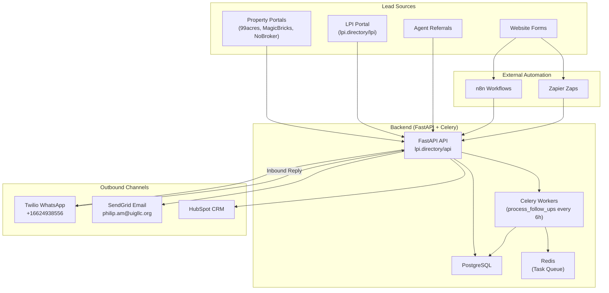

# UIG / ICP3A — Complete Automation Workflow Guide
**n8n + Zapier Implementation**
*Generated: April 2026 | Backend: `https://lpi.directory`*

---

## System Architecture Overview



---

## Three-Chain Pipeline Summary

| Chain | Trigger | Steps | Cutoff |
|-------|---------|-------|--------|
| **Chain 1 — Initial Outreach** | New lead created | T+0: WA+Email → T+8h: FU1 → T+16h: FU2 → T+24h: FU3 → T+36h: FU4 → T+48h: FU5 | T+72h → `cold_lead` |
| **Chain 2 — Document Collection** | Lead qualifies | T+0: Doc Request WA+Email → T+48h: Doc-FU1 → T+120h: Doc-FU2 → T+240h: Doc-FU3 | T+336h (14d) → `pending_docs` |
| **Chain 3 — Verification** | All docs received | AI doc analysis → SLA: 5 biz days → Escalate at 7 days | Manual review |

---

## API Endpoints Used by Automation

| Endpoint | Method | Purpose | Auth |
|----------|--------|---------|------|
| `/api/leads` | `POST` | Create a new lead | JWT or X-API-Key |
| `/api/leads/{id}/stage` | `PATCH` | Advance pipeline stage | JWT or X-API-Key |
| `/api/outreach/send` | `POST` | Send WhatsApp/email to a lead | JWT |
| `/api/leads/{id}/score` | `GET` | Get AI lead score | JWT |
| `/api/documents/{lead_id}/legal-check` | `POST` | Trigger AI document verification | X-API-Key |
| `/api/webhooks/whatsapp` | `POST` | Receive Twilio inbound WhatsApp | Public (Twilio signature) |
| `/api/webhooks/hubspot` | `POST` | Receive HubSpot events | Public (HubSpot signature) |
| `/api/webhooks/make` | `POST` | Receive Make.com/n8n/Zapier events | X-API-Key |
| `/api/webhooks/cashfree` | `POST` | Receive payment callbacks | CashFree signature |
| `/api/deals` | `POST` | Create deal record | JWT or X-API-Key |
| `/api/lpi/issue` | `POST` | Issue LPI certificate | JWT |
| `/api/lpi/verify/{code}` | `GET` | Verify LPI certificate | Public |

---

## Pipeline Stages (13 total)

```
new_lead → contact_initiated → response_received → qualified → 
docs_requested → docs_received → under_verification → approved → 
visit_scheduled → closed_won
                                                    ↘ closed_lost
                 ↘ cold_lead (72h no response)
                                   ↘ pending_docs (14d no docs)
```

---

# Part 1: n8n Workflows

> [!IMPORTANT]
> All n8n workflows use the **Webhook** trigger node and **HTTP Request** nodes to call your FastAPI backend. Set these n8n variables:
> - `BACKEND_URL` = `https://lpi.directory`
> - `UIG_API_KEY` = your `UIG_INTERNAL_API_KEY` from .env
> - `DASHBOARD_URL` = `https://lpi.directory`

---

## Workflow 1: New Lead Intake & Outreach Dispatch

**Trigger:** Webhook (receives POST from backend when a new lead is created)

```
┌──────────────┐    ┌───────────────┐    ┌─────────────┐
│ Webhook      │───▶│ Switch Node   │───▶│ Route by    │
│ Trigger      │    │ (event type)  │    │ event       │
└──────────────┘    └───────────────┘    └─────────────┘
                                              │
              ┌───────────────────────────────┤
              │                               │
              ▼                               ▼
     ┌─────────────────┐            ┌──────────────────┐
     │ new_lead         │            │ response_received│
     │                  │            │                  │
     │ → HTTP: POST     │            │ → HTTP: PATCH    │
     │   /outreach/send │            │   /leads/X/stage │
     │   (WA initial)   │            │   (qualified)    │
     │                  │            │                  │
     │ → HTTP: POST     │            │ → HTTP: POST     │
     │   /outreach/send │            │   /outreach/send │
     │   (email initial)│            │   (doc_request)  │
     │                  │            │                  │
     │ → HTTP: POST     │            │ → HubSpot:       │
     │   HubSpot API    │            │   Update Contact │
     │   (create contact)│           └──────────────────┘
     └─────────────────┘
```

### n8n Node Configuration

#### Node 1: Webhook Trigger
```json
{
  "node": "Webhook",
  "method": "POST",
  "path": "uig-lead-event",
  "authentication": "headerAuth",
  "headerName": "X-API-Key",
  "headerValue": "={{ $vars.UIG_API_KEY }}"
}
```

#### Node 2: Switch (Route by Event Type)
```json
{
  "node": "Switch",
  "rules": [
    { "value": "={{ $json.event }}", "operation": "equal", "value2": "new_lead", "output": 0 },
    { "value": "={{ $json.event }}", "operation": "equal", "value2": "response_received", "output": 1 },
    { "value": "={{ $json.event }}", "operation": "equal", "value2": "docs_uploaded", "output": 2 },
    { "value": "={{ $json.event }}", "operation": "equal", "value2": "docs_verified", "output": 3 },
    { "value": "={{ $json.event }}", "operation": "equal", "value2": "lead_approved", "output": 4 },
    { "value": "={{ $json.event }}", "operation": "equal", "value2": "lead_rejected", "output": 5 }
  ]
}
```

#### Node 3a: Send WhatsApp (new_lead branch)
```json
{
  "node": "HTTP Request",
  "method": "POST",
  "url": "={{ $vars.BACKEND_URL }}/api/outreach/send",
  "headers": {
    "Content-Type": "application/json",
    "X-API-Key": "={{ $vars.UIG_API_KEY }}"
  },
  "body": {
    "lead_id": "={{ $json.lead_id }}",
    "channel": "whatsapp",
    "template": "initial_contact_whatsapp"
  }
}
```

#### Node 3b: Send Email (new_lead branch)
```json
{
  "node": "HTTP Request",
  "method": "POST",
  "url": "={{ $vars.BACKEND_URL }}/api/outreach/send",
  "headers": {
    "Content-Type": "application/json",
    "X-API-Key": "={{ $vars.UIG_API_KEY }}"
  },
  "body": {
    "lead_id": "={{ $json.lead_id }}",
    "channel": "email",
    "template": "initial_contact_email"
  }
}
```

#### Node 3c: HubSpot Create Contact (new_lead branch)
```json
{
  "node": "HubSpot",
  "resource": "contact",
  "operation": "create",
  "email": "={{ $json.email }}",
  "additionalFields": {
    "firstname": "={{ $json.owner_name }}",
    "phone": "={{ $json.phone }}",
    "city": "={{ $json.city }}",
    "hs_lead_status": "NEW",
    "lifecyclestage": "lead"
  }
}
```

---

## Workflow 2: Response Handler

**Trigger:** Webhook (receives POST when lead responds via WhatsApp)

```
┌──────────────┐    ┌──────────────┐    ┌──────────────┐    ┌──────────────┐
│ Webhook      │───▶│ HTTP: PATCH  │───▶│ HTTP: POST   │───▶│ HubSpot:     │
│ (response    │    │ /leads/X/    │    │ /outreach/   │    │ Update       │
│  received)   │    │ stage →      │    │ send         │    │ Contact →    │
│              │    │ "qualified"  │    │ (doc_request) │    │ IN_PROGRESS  │
└──────────────┘    └──────────────┘    └──────────────┘    └──────────────┘
```

### n8n Nodes

#### Node 1: Webhook
```json
{
  "node": "Webhook",
  "method": "POST",
  "path": "uig-response",
  "authentication": "headerAuth"
}
```

#### Node 2: Advance to Qualified
```json
{
  "node": "HTTP Request",
  "method": "PATCH",
  "url": "={{ $vars.BACKEND_URL }}/api/leads/{{ $json.lead_id }}/stage",
  "body": { "stage": "qualified" }
}
```

#### Node 3: Send Document Request
```json
{
  "node": "HTTP Request",
  "method": "POST",
  "url": "={{ $vars.BACKEND_URL }}/api/outreach/send",
  "body": {
    "lead_id": "={{ $json.lead_id }}",
    "channel": "whatsapp",
    "template": "document_request_whatsapp"
  }
}
```

---

## Workflow 3: Document Upload Handler

**Trigger:** Webhook (fires when lead uploads documents)

```
┌──────────────┐    ┌──────────────┐    ┌──────────────┐    ┌──────────────┐
│ Webhook      │───▶│ HTTP: POST   │───▶│ HTTP: PATCH  │───▶│ Email:       │
│ (docs_       │    │ /documents/  │    │ /leads/X/    │    │ Notify       │
│  uploaded)   │    │ X/legal-check│    │ stage →      │    │ Philip       │
│              │    │ (AI verify)  │    │ under_verif. │    │ George       │
└──────────────┘    └──────────────┘    └──────────────┘    └──────────────┘
```

### n8n Nodes

#### Node 2: Trigger AI Document Verification
```json
{
  "node": "HTTP Request",
  "method": "POST",
  "url": "={{ $vars.BACKEND_URL }}/api/documents/{{ $json.lead_id }}/legal-check",
  "headers": { "X-API-Key": "={{ $vars.UIG_API_KEY }}" }
}
```

#### Node 3: Advance Stage
```json
{
  "node": "HTTP Request",
  "method": "PATCH",
  "url": "={{ $vars.BACKEND_URL }}/api/leads/{{ $json.lead_id }}/stage",
  "body": { "stage": "under_verification" }
}
```

#### Node 4: Internal Notification
```json
{
  "node": "Send Email",
  "to": "philip.am@uigllc.org",
  "subject": "[UIG] Documents received — Lead #{{ $json.lead_id }}",
  "html": "<p>Documents uploaded for Lead <b>#{{ $json.lead_id }}</b> ({{ $json.owner_name }}).</p><p>AI verification triggered. <a href='{{ $vars.DASHBOARD_URL }}/dashboard/leads/{{ $json.lead_id }}'>View in Dashboard</a></p>"
}
```

---

## Workflow 4: Verification Complete → Deal Creation

**Trigger:** Webhook (fires when docs pass AI verification)

```
┌──────────────┐    ┌──────────────┐    ┌──────────────┐    ┌──────────────┐    ┌──────────────┐
│ Webhook      │───▶│ HTTP: PATCH  │───▶│ HTTP: POST   │───▶│ HubSpot:     │───▶│ Email:       │
│ (docs_       │    │ /leads/X/    │    │ /outreach/   │    │ Create Deal  │    │ Notify       │
│  verified)   │    │ stage →      │    │ send (site   │    │              │    │ Philip       │
│              │    │ "approved"   │    │ visit invite) │    │              │    │              │
└──────────────┘    └──────────────┘    └──────────────┘    └──────────────┘    └──────────────┘
```

---

## Workflow 5: Lead Rejection Handler

**Trigger:** Webhook (fires when lead/property is rejected)

```
┌──────────────┐    ┌──────────────┐    ┌──────────────┐
│ Webhook      │───▶│ HTTP: POST   │───▶│ HubSpot:     │
│ (lead_       │    │ /outreach/   │    │ Update →     │
│  rejected)   │    │ send         │    │ UNQUALIFIED  │
│              │    │ (polite      │    │ closed_lost  │
│              │    │  decline)    │    │              │
└──────────────┘    └──────────────┘    └──────────────┘
```

---

## Workflow 6: LPI Certificate Issued → Acquisition Pitch

**Trigger:** Webhook (fires when LPI certificate is issued via portal)

```
┌──────────────┐    ┌──────────────┐    ┌──────────────┐    ┌──────────────┐
│ Webhook      │───▶│ HTTP: POST   │───▶│ HubSpot:     │───▶│ HTTP: POST   │
│ (lpi_issued) │    │ /api/leads   │    │ Create       │    │ /outreach/   │
│              │    │ (create lead)│    │ Contact      │    │ send (lpi_   │
│              │    │              │    │              │    │ acq_pitch)   │
└──────────────┘    └──────────────┘    └──────────────┘    └──────────────┘
```

---

## Workflow 7: Agent Onboarding

**Trigger:** Webhook (fires when RERA agent submits via portal)

```
┌──────────────┐    ┌──────────────┐    ┌──────────────┐    ┌──────────────┐
│ Webhook      │───▶│ HTTP: POST   │───▶│ HTTP: POST   │───▶│ HubSpot:     │
│ (agent_      │    │ /api/agents  │    │ /agents/{id}/│    │ Create       │
│  signup)     │    │ (create)     │    │ pitch (WA)   │    │ Contact      │
│              │    │              │    │              │    │ (AGENT tag)  │
└──────────────┘    └──────────────┘    └──────────────┘    └──────────────┘
```

---

# Part 2: Zapier Zaps

> [!IMPORTANT]
> Zapier uses "Zaps" with Triggers and Actions. Each zap below maps to one n8n workflow above. Use:
> - **Trigger:** "Webhooks by Zapier" → Catch Hook
> - **Action:** "Webhooks by Zapier" → Custom Request (for HTTP calls to your API)
> - **Action:** "HubSpot" native integration for CRM operations
> - **Action:** "Email by Zapier" or "Gmail" for internal notifications

---

## Zap 1: New Lead → Outreach + HubSpot

| Step | Type | App | Configuration |
|------|------|-----|---------------|
| 1 | Trigger | **Webhooks by Zapier** | Catch Hook → URL given to backend as `MAKE_WEBHOOK_URL` |
| 2 | Filter | **Filter by Zapier** | `event` equals `new_lead` |
| 3 | Action | **Webhooks by Zapier** | Custom Request → `POST {{BACKEND_URL}}/api/outreach/send` → Body: `{"lead_id": X, "channel": "whatsapp", "template": "initial_contact_whatsapp"}` |
| 4 | Action | **Webhooks by Zapier** | Custom Request → `POST {{BACKEND_URL}}/api/outreach/send` → Body: `{"lead_id": X, "channel": "email", "template": "initial_contact_email"}` |
| 5 | Action | **HubSpot** | Create Contact → email, firstname, phone, city, hs_lead_status=NEW |

---

## Zap 2: Response Received → Qualify + Doc Request

| Step | Type | App | Configuration |
|------|------|-----|---------------|
| 1 | Trigger | **Webhooks by Zapier** | Catch Hook |
| 2 | Filter | **Filter by Zapier** | `event` equals `response_received` |
| 3 | Action | **Webhooks by Zapier** | Custom Request → `PATCH {{BACKEND_URL}}/api/leads/{{lead_id}}/stage` → Body: `{"stage": "qualified"}` |
| 4 | Action | **Webhooks by Zapier** | Custom Request → `POST {{BACKEND_URL}}/api/outreach/send` → Body: `{"lead_id": X, "channel": "whatsapp", "template": "document_request_whatsapp"}` |
| 5 | Action | **HubSpot** | Update Contact → hs_lead_status=IN_PROGRESS, uig_pipeline_stage=qualified |

---

## Zap 3: Docs Uploaded → AI Verify + Notify Philip

| Step | Type | App | Configuration |
|------|------|-----|---------------|
| 1 | Trigger | **Webhooks by Zapier** | Catch Hook |
| 2 | Filter | **Filter by Zapier** | `event` equals `docs_uploaded` |
| 3 | Action | **Webhooks by Zapier** | Custom Request → `POST {{BACKEND_URL}}/api/documents/{{lead_id}}/legal-check` |
| 4 | Action | **Webhooks by Zapier** | Custom Request → `PATCH {{BACKEND_URL}}/api/leads/{{lead_id}}/stage` → `{"stage": "under_verification"}` |
| 5 | Action | **Email by Zapier** | To: philip.am@uigllc.org → Subject: "[UIG] Docs received — Lead #{{lead_id}}" |

---

## Zap 4: Docs Verified → Approve + Deal + Notify

| Step | Type | App | Configuration |
|------|------|-----|---------------|
| 1 | Trigger | **Webhooks by Zapier** | Catch Hook |
| 2 | Filter | **Filter by Zapier** | `event` equals `docs_verified` |
| 3 | Action | **Webhooks by Zapier** | `PATCH /api/leads/{{lead_id}}/stage` → `{"stage": "approved"}` |
| 4 | Action | **Webhooks by Zapier** | `POST /api/outreach/send` → `{"lead_id": X, "channel": "whatsapp", "template": "site_visit_invitation"}` |
| 5 | Action | **HubSpot** | Create Deal → dealname, amount, pipeline=default, dealstage=appointmentscheduled |
| 6 | Action | **Email by Zapier** | To: philip.am@uigllc.org → "✅ Lead #X Approved — Schedule Site Visit" |

---

## Zap 5: Lead Rejected → Polite Decline + CRM Update

| Step | Type | App | Configuration |
|------|------|-----|---------------|
| 1 | Trigger | **Webhooks by Zapier** | Catch Hook |
| 2 | Filter | **Filter by Zapier** | `event` equals `lead_rejected` |
| 3 | Action | **Webhooks by Zapier** | `POST /api/outreach/send` → `{"lead_id": X, "channel": "whatsapp", "template": "polite_decline"}` |
| 4 | Action | **HubSpot** | Update Contact → hs_lead_status=UNQUALIFIED, uig_pipeline_stage=closed_lost |

---

## Zap 6: LPI Certificate Issued → Create Lead + Pitch

| Step | Type | App | Configuration |
|------|------|-----|---------------|
| 1 | Trigger | **Webhooks by Zapier** | Catch Hook |
| 2 | Filter | **Filter by Zapier** | `event` equals `lpi_issued` |
| 3 | Action | **Webhooks by Zapier** | `POST /api/leads` → create lead from LPI applicant data |
| 4 | Action | **HubSpot** | Create Contact |
| 5 | Action | **Webhooks by Zapier** | `POST /api/outreach/send` → `{"template": "lpi_acquisition_pitch"}` |

---

# Part 3: What Celery Handles Internally (No external automation needed)

> [!NOTE]
> These tasks are handled entirely by the Celery Beat scheduler inside the Docker container. You do NOT need to replicate them in n8n or Zapier.

| Celery Task | Schedule | What It Does |
|-------------|----------|-------------|
| `process_follow_ups` | Every 6 hours | Scans all leads in `contact_initiated` and `docs_requested` stages. Sends follow-ups based on 3-chain timing. Moves unresponsive leads to `cold_lead` at 72h and `pending_docs` at 14 days. |
| `send_initial_outreach(lead_id)` | Dispatched immediately on lead creation | Sends first WA + email, sets stage to `contact_initiated` |
| `send_follow_up(lead_id, N)` | Dispatched by `process_follow_ups` | Sends follow-up #N (1-5) via WhatsApp |
| `send_doc_follow_up(lead_id, N)` | Dispatched by `process_follow_ups` | Sends doc collection follow-up #N (1-3) |
| `send_document_request(lead_id)` | Dispatched when lead qualifies | Sends state-specific doc checklist via WA + email |

---

# Part 4: Webhook Payload Reference

## Outbound (Backend → n8n/Zapier)

Your backend sends these events to `MAKE_WEBHOOK_URL`:

```json
{
  "event": "new_lead | response_received | docs_uploaded | docs_verified | lead_approved | lead_rejected | lpi_issued | agent_signup",
  "lead_id": 42,
  "owner_name": "Rajesh Kumar",
  "phone": "+919876543210",
  "email": "rajesh@example.com",
  "city": "Delhi",
  "property_address": "Plot 15, Aerocity Phase 2, IGI Airport Road",
  "price": 25000000,
  "transaction_type": "buy",
  "hubspot_contact_id": "12345",
  "lpi_code": "LPI-IN-DL-285562-770100-A7B3",
  "rejection_reason": "Documents incomplete"
}
```

## Inbound (n8n/Zapier → Backend)

```json
// POST /api/webhooks/make
{
  "action": "send_initial_outreach | send_document_request",
  "lead_id": 42,
  "transaction_type": "buy"
}
```

---

# Part 5: Setup Checklist

## n8n Setup
- [ ] Self-host n8n or use n8n Cloud
- [ ] Create 7 workflows (matching the 7 above)
- [ ] Set n8n variables: `BACKEND_URL`, `UIG_API_KEY`, `DASHBOARD_URL`
- [ ] Copy each Webhook node's URL
- [ ] Set the primary webhook URL in `.env` as `MAKE_WEBHOOK_URL`
- [ ] Configure HubSpot credentials in n8n (OAuth2 with portal ID `245867686`)
- [ ] Test each workflow with a sample payload

## Zapier Setup
- [ ] Create 6 Zaps (matching Zaps 1-6 above)
- [ ] Use "Webhooks by Zapier" → Catch Hook for each trigger
- [ ] Copy the Zapier webhook URL → set in `.env` as `MAKE_WEBHOOK_URL`
- [ ] Configure HubSpot native integration
- [ ] Set API key in Custom Request headers: `X-API-Key: {{UIG_INTERNAL_API_KEY}}`
- [ ] Test each Zap with a sample payload

> [!WARNING]
> You can only use ONE webhook URL in `.env`. If you use n8n, point `MAKE_WEBHOOK_URL` to n8n. If you use Zapier, point it to Zapier. To use both simultaneously, set up n8n as the primary and have it forward events to Zapier via an HTTP Request node.

---

# Part 6: API Secrets Verification (Current Status)

| Secret | Status | Value Present |
|--------|--------|--------------|
| `TWILIO_ACCOUNT_SID` | ✅ Set | `AC1bbb711e...` |
| `TWILIO_AUTH_TOKEN` | ✅ Set | `5de63385...` |
| `TWILIO_WHATSAPP_FROM` | ✅ Set | `whatsapp:+16624938556` |
| `SENDGRID_API_KEY` | ✅ Set | `SG.bHJ7HN...` |
| `HUBSPOT_API_KEY` | ✅ Set | `na2-8b19-...` |
| `HUBSPOT_PORTAL_ID` | ✅ Set | `245867686` |
| `CASHFREE_APP_ID` | ✅ Set | `117797465...` |
| `CASHFREE_SECRET_KEY` | ✅ Set | `cfsk_ma_prod_...` |
| `APIFY_API_TOKEN` | ✅ Set | `apify_api_m1L...` |
| `OPENROUTER_API_KEY` | ✅ Set | `sk-or-v1-...` |
| `GROQ_API_KEY` | ✅ Set | `gsk_tIYi...` |
| `ANTHROPIC_API_KEY` | ⚠️ Empty | Needed for Claude AI lead scoring |
| `GOOGLE_SERVICE_ACCOUNT_JSON` | ⚠️ Empty | Needed for Google Drive doc storage |
| `GOOGLE_DRIVE_FOLDER_ID` | ⚠️ Empty | Needed for Google Drive doc storage |
| `MAKE_WEBHOOK_URL` | ⚠️ Empty | Set after n8n/Zapier webhook is created |
| `UIG_INTERNAL_API_KEY` | ⚠️ Default | Change `change-me-internal-api-key` to a real secret |
